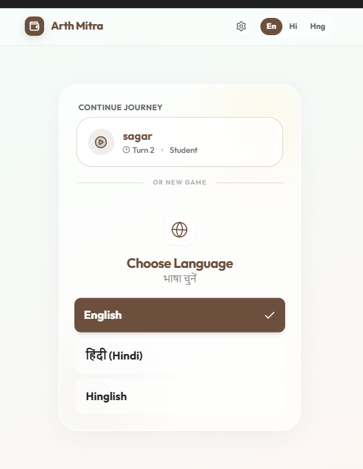
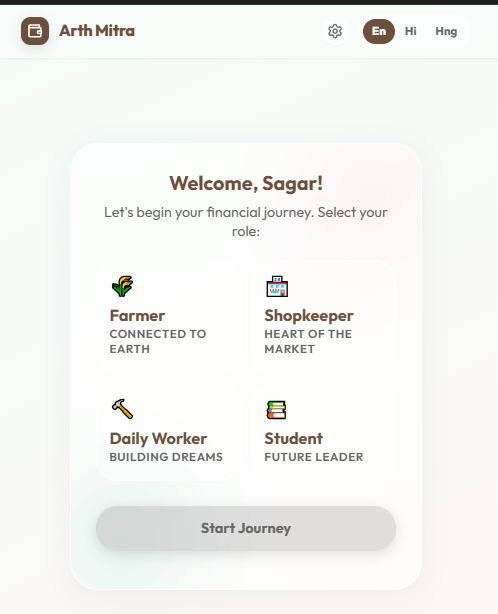
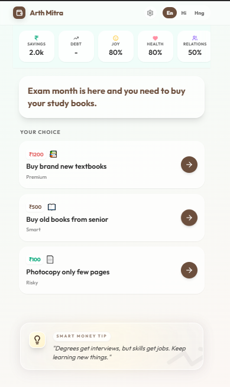
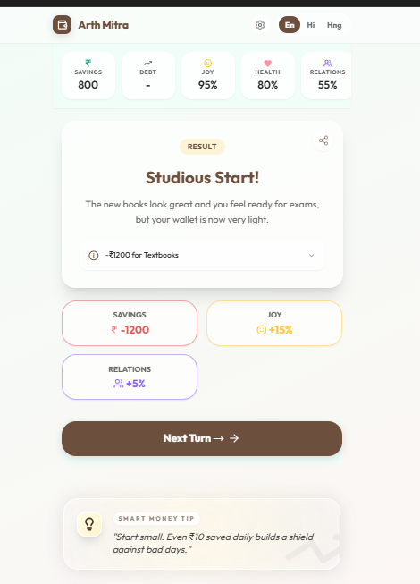

#  Arth Mitra — Your Financial Companion

> *"Arth" means wealth in Sanskrit. "Mitra" means friend. Together — your money's best friend.*

**Arth Mitra** is an AI-powered, gamified financial literacy app built for everyday Indians — farmers, shopkeepers, daily workers, and students. It teaches real-world money decisions through story-driven scenarios in English, Hindi, and Hinglish.

Built for the **[Innovate4FinLit Game Challenge](https://hack2skill.com/innovate4finlit)** by NCFE (National Centre for Financial Education) — a national initiative to make financial education accessible, engaging, and impactful across India.

---

## 🎮 What Is Arth Mitra?

Arth Mitra puts you in the shoes of a real Indian persona and presents financial decisions you'd actually face — broken phone, tempting EMIs, unexpected expenses. Every choice has consequences tracked across **Savings, Joy, Health, and Relations** stats.

It's not a quiz. It's a life simulator for your wallet.

---

## ✨ Features

-  **Role-based personas** — Play as a Farmer, Shopkeeper, Daily Worker, or Student
-  **Multilingual support** — English, हिंदी (Hindi), and Hinglish
-  **Scenario-driven gameplay** — Real financial dilemmas with meaningful trade-offs
-  **Live stat tracking** — Savings, Debt, Joy, Health, and Relations update with every choice
-  **Smart Money Tips** — Contextual financial wisdom after each decision
-  **Result feedback** — Immediate consequence cards showing what changed and why
-  **Powered by Google Gemini AI** — Dynamic scenario generation via AI Studio

---

## 📸 Screenshots

<table>
<tr>
<th>Homepage / Language</th>
<th>Role Selection</th>
<th>Scenario</th>
<th>Result</th>
</tr>

<tr>
<td align="center">

</td>

<td align="center">

</td>

<td align="center">

</td>

<td align="center">

</td>
</tr>
</table>


### Installation

```bash
# 1. Clone the repository
git clone https://github.com/itssagarK/Arth-Mitra.git
cd Arth-Mitra

# 2. Install dependencies
npm install

# 3. Set up your environment
cp .env.local.example .env.local
# Add your Gemini API key to .env.local:
# GEMINI_API_KEY=your_key_here

# 4. Run the app
npm run dev
```

Open [http://localhost:5173](http://localhost:5173) in your browser.

---

## 🎯 How It Works

1. **Choose your language** — English, Hindi, or Hinglish
2. **Select your persona** — Each role has unique financial context and starting stats
3. **Face a scenario** — A real-life money situation is presented
4. **Make your choice** — Pick from 2–3 options, each with different costs and risks
5. **See the outcome** — Stats update, a result card explains consequences, and a financial tip appears
6. **Repeat** — New scenarios keep the journey going

---

This project was built for the **Innovate4FinLit Game Challenge** organized by:

- **NCFE** (National Centre for Financial Education)
- Mission: Making financial literacy accessible to all Indians through gamified solutions

---

## 🤝 Contributing

Contributions are welcome! If you'd like to add new scenarios, languages, or personas:

1. Fork the repository
2. Create a feature branch (`git checkout -b feature/new-scenarios`)
3. Commit your changes (`git commit -m 'feat: add rural banking scenarios'`)
4. Push and open a Pull Request

---

## 📄 License

This project is open source and available under the [MIT License](./LICENSE).

---

## 👤 Author

**Sagar** — [@itssagarK](https://github.com/itssagarK)

---

*Made with ❤️ for financial literacy in India*
